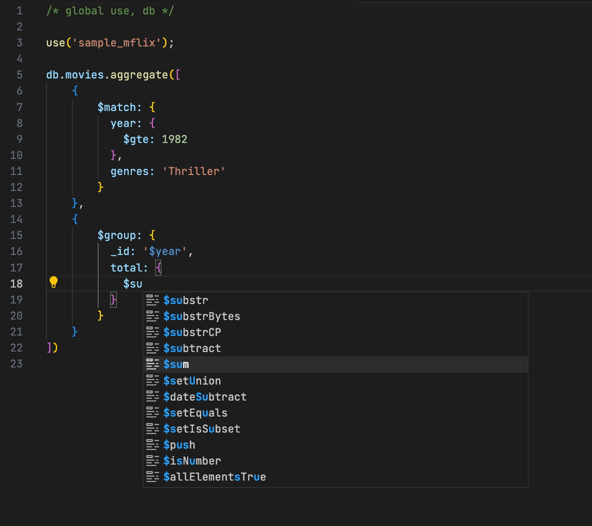
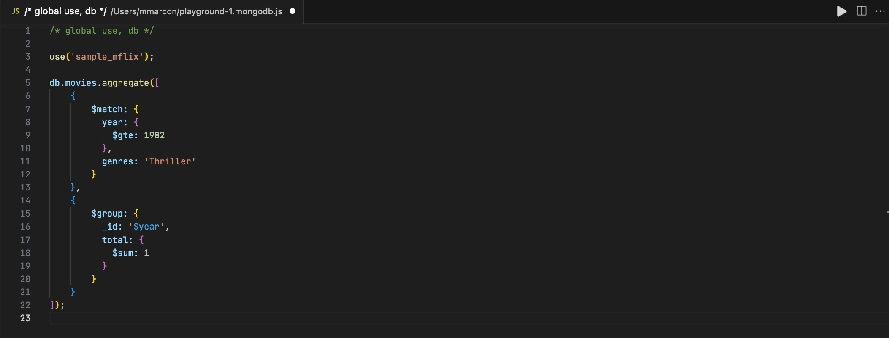
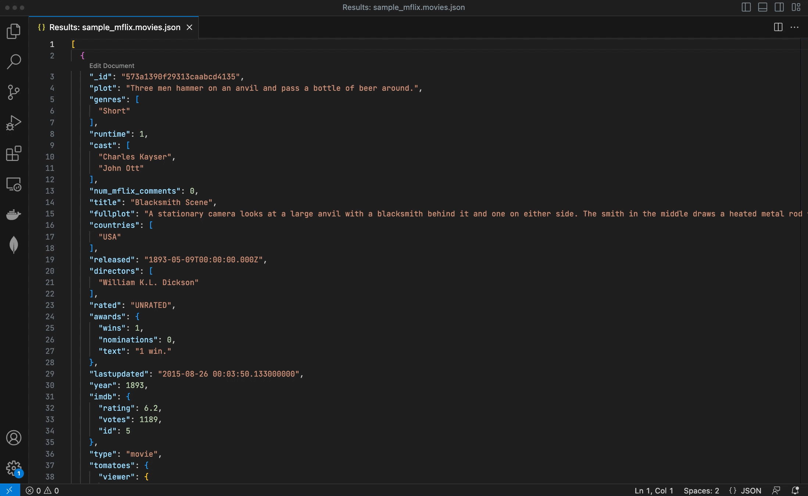
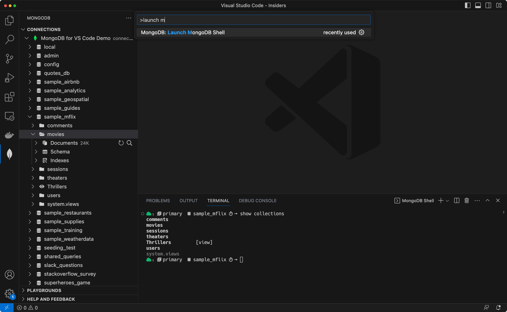

# MongoDB for VS Code

[](https://github.com/mongodb-js/vscode/actions/workflows/test-and-build.yaml)

MongoDB for VS Code makes it easy to work with work with your data in MongoDB directly from your VS Code environment. MongoDB for VS Code is the perfect companion for [MongoDB Atlas](https://www.mongodb.com/cloud/atlas/register), but you can also use it with your self-managed MongoDB instances.

## Features

### Navigate your MongoDB Data

- Navigate your databases, collections, and read-only views
- See the documents in your collections
- Edit documents and save changes to the database
- Get a quick overview of your schema and your indexes

Read more about this functionality in the [online documentation](https://www.mongodb.com/docs/mongodb-vscode/databases-collections/).


### MongoDB Playgrounds

[MongoDB Playgrounds](https://www.mongodb.com/docs/mongodb-vscode/playgrounds/) are the most convenient way to prototype and execute CRUD operations and other MongoDB commands directly inside VS Code.

- Prototype your queries, aggregations, and MongoDB commands with convenient syntax highlighting and intelligent autocomplete for MongoDB Shell API, BSON types, MongoDB Query API, system variables, and for database, collection, and field names.
- Run your playgrounds and see the results instantly. Click the play button in the tab bar to see the output.
- Edit documents returned by your playground.
- Save your playground together with your application code to always have a place where all your queries are documented and can be tested just with one click.



_Note: Make sure you are connected to a server or cluster before using a playground. You can't run a playground and you won't get intelligent completions if you are not connected._

#### From Query API to your favorite language

Select queries and aggregations within your Playground files and translate them into your favorite programming language. Supported languages are:

 * Java
 * Node.js
 * C#
 * Python 3
 * Ruby



### Document Editing

Editing docunments with MongoDB for VS Code is as natural as editing any file in the code editor. Open a document in an editor tab, edit it and save the changes back to MongoDB.



### Quick access to the MongoDB Shell

Launch the MongoDB Shell from the command palette to quickly connect to the same cluster you have active in VS Code.



_Note: The shell binary needs to be in your `$PATH`. The shell binary can be either the [MongoDB Shell](https://www.mongodb.com/products/shell) (`mongosh`) or the legacy `mongo` shell. In the extension's settings you can switch between the two. `mongosh` is the default._

### Terraform snippet for MongoDB Atlas

If you use Terraform to manage your infrastructure, MongoDB for VS Code helps you get started with the [MongoDB Atlas Provider](https://www.terraform.io/docs/providers/mongodbatlas/index.html). Just open a Terraform file, type `atlas` and you are good to go.


## Extension Settings

| Setting                                                            	| Description                                                                                                                                                                                                                          	| Default                                                                                                                    	|
|--------------------------------------------------------------------	|--------------------------------------------------------------------------------------------------------------------------------------------------------------------------------------------------------------------------------------	|----------------------------------------------------------------------------------------------------------------------------	|
| `mdb.shell`                                                        	| The MongoDB shell to use ( `mongosh`  or the legacy  `mongo` ).                                                                                                                                                                      	| `mongosh`                                                                                                                  	|
| `mdb.showMongoDBConnectionExplorer`                                	| Show or hide the MongoDB Connection explorer.                                                                                                                                                                                        	| `true`                                                                                                                     	|
| `mdb.showMongoDBPlaygrounds`                                       	| Show or hide the MongoDB Playgrounds explorer.                                                                                                                                                                                       	| `true`                                                                                                                     	|
| `mdb.showMongoDBHelpExplorer`                                      	| Show or hide the MongoDB Help panel.                                                                                                                                                                                                 	| `true`                                                                                                                     	|
| `mdb.defaultLimit`                                                 	| The number of documents to fetch when viewing documents from a collection.                                                                                                                                                           	| `10`                                                                                                                       	|
| `mdb.confirmRunAll`                                                	| Show a confirmation message before running commands in a playground.                                                                                                                                                                 	| `true`                                                                                                                     	|
| `mdb.confirmDeleteDocument`                                        	| Show a confirmation message before deleting a document in the tree view.                                                                                                                                                             	| `true`                                                                                                                     	|
| `mdb.excludeFromPlaygroundsSearch`                                 	| Exclude files and folders while searching for playground files in the current workspace.                                                                                                                                             	| Refer to [`package.json`](https://github.com/mongodb-js/vscode/blob/7b10092db4c8c10c4aa9c45b443c8ed3d5f37d5c/package.json) 	|
| `mdb.connectionSaving.hideOptionToChooseWhereToSaveNewConnections` 	| When a connection is added, a prompt is shown that let's the user decide where the new connection should be saved. When this setting is checked, the prompt is not shown and the default connection saving location setting is used. 	| `true`                                                                                                                     	|
| `mdb.connectionSaving.defaultConnectionSavingLocation`             	| When the setting that hides the option to choose where to save new connections is checked, this setting sets if and where new connections are saved.                                                                                 	| `Global`                                                                                                                   	|
| `mdb.useDefaultTemplateForPlayground`                              	| Choose whether to use the default template for playground files or to start with an empty playground editor.                                                                                                                         	| `true`                                                                                                                     	|
| `mdb.uniqueObjectIdPerCursor`                                      	| The default behavior is to generate a single ObjectId and insert it on all cursors. Set to true to generate a unique ObjectId per cursor instead.                                                                                    	| `false`                                                                                                                    	|
| `mdb.sendTelemetry`                                                	| Opt-in and opt-out for diagnostic and telemetry collection.                                                                                                                                                                          	| `true`                                                                                                                     	|
## Additional Settings

### Autocomplete

_Note: these global settings affect how MongoDB for VS Code provides intelligent autocomplete inside snippets and string literals (off by default). Changing the default configuration may affect the behavior and performance of other extensions and of VS Code itself. If you do not change the default settings, you can still trigger intelligent autocomplete inside a snippet or string literal with `Ctrl+Space`._

- `editor.suggest.snippetsPreventQuickSuggestions`: By default, VS Code prevents code completion in snippet mode (editing placeholders in inserted code). Setting this to `false` allows snippet (eg. `$match`, `$addFields`) and field completion based on the document schema for the `db.collection.aggregate()` expressions.
- `editor.quickSuggestions`: By default, VS Code prevents code completion inside string literals. To enable database names completions for `use('dbName')` expression use this configuration:

```
"editor.quickSuggestions": {
  "other": true,
  "comments": false,
  "strings": true
}
```

### Syntax Highlighting

MongoDB playgrounds are JavaScript files, which causes JavaScript syntax highlighting to override any customizations made to the MongoDB syntax colors.

Currently, there is no way to resolve this except for turning off semantic highlighting for a current workspace, or for all themes that are being used by setting `editor.semanticHighlighting.enabled` to `false`.

## Telemetry

MongoDB for VS Code collects usage data and sends it to MongoDB to help improve our products and services. Read our [privacy policy](https://www.mongodb.com/legal/privacy-policy) to learn more. If you don’t wish to send usage data to MongoDB, you can opt-out by setting `mdb.sendTelemetry` to `false` in the extension settings.

## Contributing

For issues, please create a ticket in our [JIRA Project](https://jira.mongodb.org/browse/VSCODE).

For contributing, please refer to [CONTRIBUTING.md](CONTRIBUTING.md).

Is there anything else you’d like to see in MongoDB for VS Code? Let us know by submitting suggestions in our [feedback forum](https://feedback.mongodb.com/forums/929236-mongodb-for-vs-code).

## Building and Installing from Source

You can clone this [repository](https://github.com/mongodb-js/vscode) and install the extension in your VS Code with:

```shell
npm install
npm run local-install
```

This will compile and package MongoDB for VS Code into a `.vsix` file and add the extension to your VS Code.

To install this locally on Windows:

```shell
npm install
.\node_modules\.bin\vsce.cmd package
code --install-extension ./mongodb-vscode-*.vsix
```

This will compile and package MongoDB for VS Code into a `.vsix` file and add the extension to your VS Code.

If you get an error because the `code` command is not found, you need to install it in your `$PATH`.

Open VS Code, launch the Command Palette (⌘+Shift+P on macOS, Ctrl+Shift+P on Windows and Linux), type `code` and select "Install code command in \$PATH".

## License

[Apache 2.0](./LICENSE.txt)
