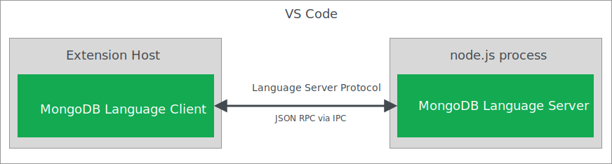
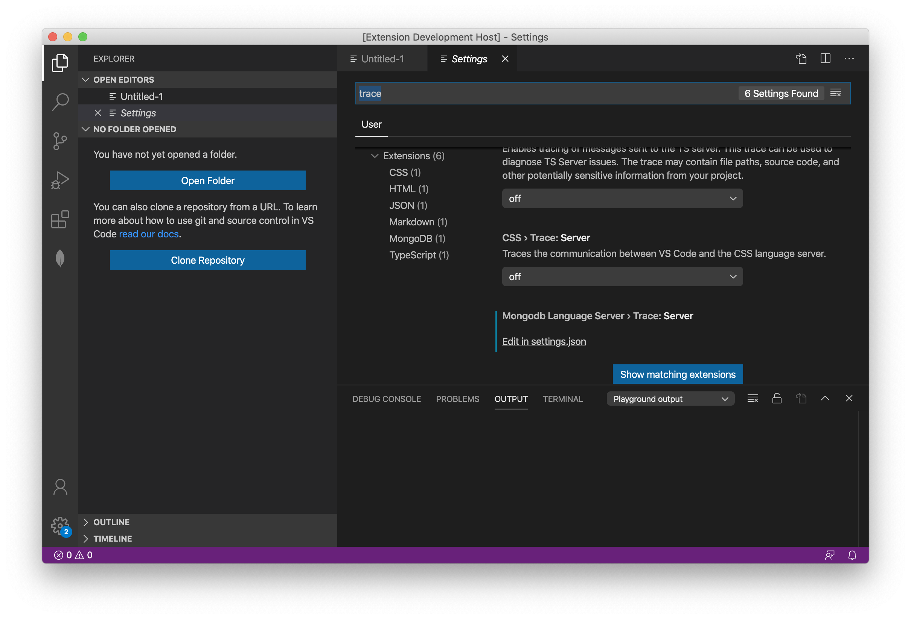
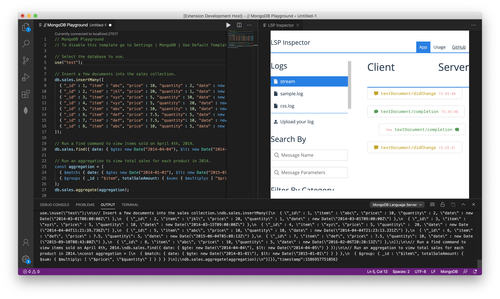

# MongoDB Language Server

**MongoDB Language Server** runs as a separate node.js process using [vscode-languageserver](https://github.com/microsoft/vscode-languageserver-node/tree/master/server)

**MongoDB Language Client** runs next to UI code and uses [vscode-languageclient](https://github.com/microsoft/vscode-languageserver-node/tree/master/client) for JSON RPC over IPC.



The language server protocol [(LSP)](https://microsoft.github.io/language-server-protocol/specification) is mainly used as a tool between the editor (the client) and a language smartness provider (the server) to integrate features like autocomplete, go to definition, find all references, list document symbols, signature help and much more. You can find the complete list of supported features in [the official documentation](https://code.visualstudio.com/api/language-extensions/language-server-extension-guide).

We can also extend the mongodb language server and client with custom methods to leverage it as a background worker. Because the language server is a separate JSON RPC enabled process, we can add RPC definitions for:

- Execute playground .mongodb scripts with mongosh repl evaluator thingie
- Schema analysis and caching

### Debugging

#### Client

Debugging the client code is as easy as debugging a normal extension. Set a breakpoint in the client code and debug the extension by pressing `F5`.

#### Server

Since the server is started by the `LanguageClient` running separately, we need to attach a debugger to the running server. To do so, switch to the Run view and select the launch configuration `Extension + Server Inspector` and press `F5`. This will run both the extension and the Server Inspector.


### Logging Support

In `.vscode/settings.json` specify a `mongodbLanguageServer.trace.server` setting that instructs the Client to log communications between Language Client/Server to a channel of the Language Client's name.

```json
"mongodbLanguageServer.trace.server": {
  "format": "json",
  "verbosity": "verbose"
},
```

You can also configure logging from VSCode setting interface.



The logs will be printed in the `MongoDB Language Server` Output Channel.

These logs are useful for developing and testing the Language Server, but they can be lengthy and hard to read. To visualize Cleint/Server logs use the [Language Server Protocol Inspector](https://github.com/Microsoft/language-server-protocol-inspector).

#### Strem Logs To LSP Inspector

- Install the [Language Server Protocol Inspector](https://marketplace.visualstudio.com/items?itemName=octref.lsp-inspector-webview) webview extension.
- Run the MongoDB extension.
- Activate the extension using any activation command.
- Open a playground.
- Check `mongodbLanguageServer.trace.server` settings.
- Run command "LSP Inspector: Start LSP Inspector" to open the LSP inspector webview.
- Run command "LSP Inspector: Start Stream LSP Logs" to start streaming logs to the LSP inspector port specified by the `languageServerExample.port` setting (The default value is 7000).



https://github.com/microsoft/vscode-extension-samples/tree/master/lsp-log-streaming-sample
https://github.com/microsoft/vscode-extension-samples/tree/master/lsp-sample

#### LSP Notifications

From the server:

```javascript
connection.sendNotification('showInformationMessage', `Hi, Friend.`);
```

From the client:

```javascript
client.onNotification('showInformationMessage', (messsage) => {
  vscode.window.showInformationMessage(messsage);
});
```


